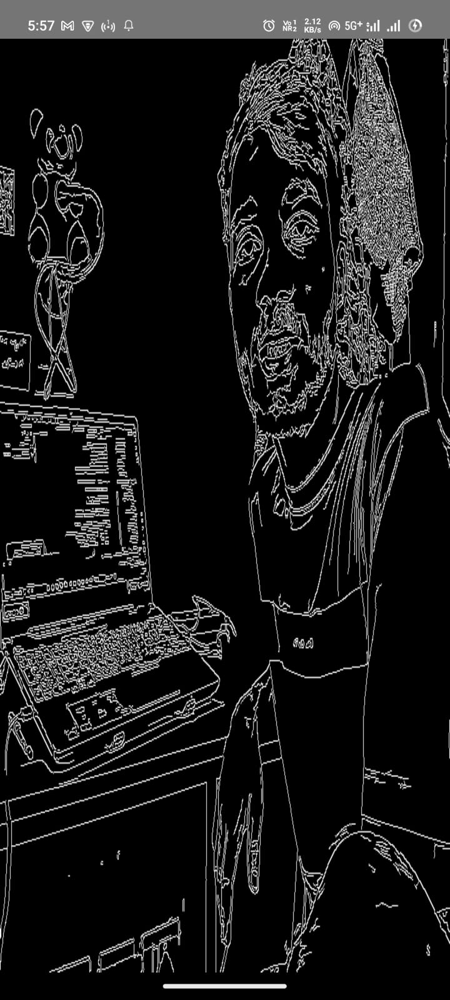
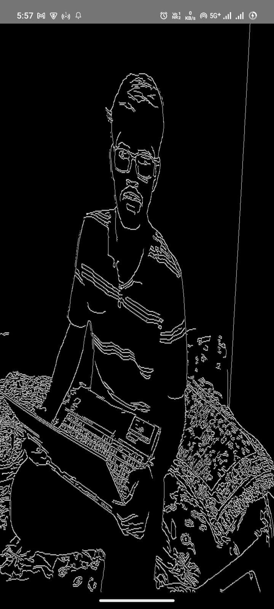
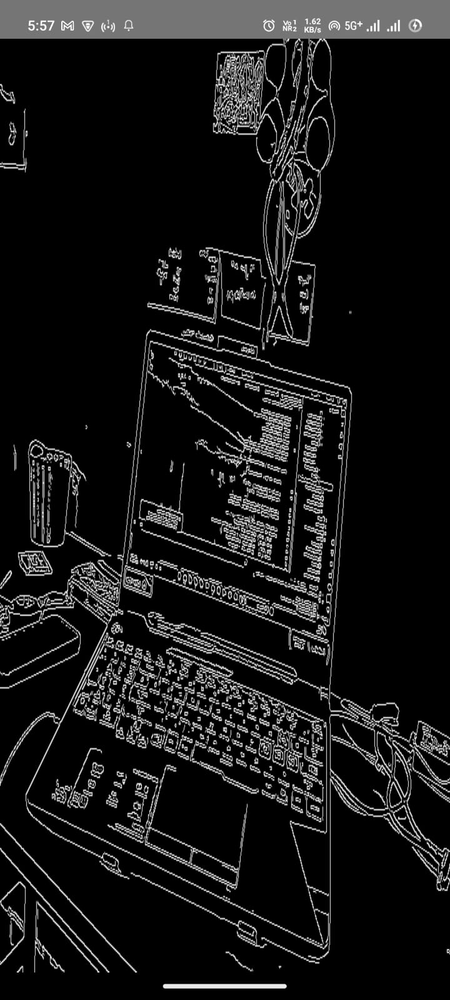
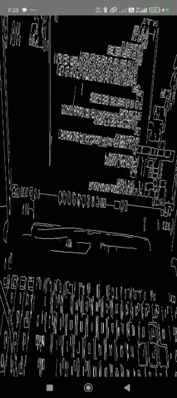

# Real-Time Canny Edge Detection Viewer

## Implemented Features

Android (Kotlin/NDK)

- Real-Time Frame Capture: Captures live video stream efficiently using CameraX.

- Native Edge Detection: Executes OpenCV's Canny algorithm directly in C++ (NDK) for zero-lag processing.

- High-Speed Rendering: Displays the processed output using OpenGL ES 2.0 for GPU acceleration.

- Zero-Copy Efficiency: Passes raw frame buffers via JNI to minimize data transfer overhead.

Web (HTML/JS)

- Static Output Viewer: Simple HTML/CSS template designed to display a single static image (screenshot) of the final processed output.

## Setup Instructions (NDK & OpenCV)

To build and run the Android application, you must configure your native development environment.

1. NDK and CMake Installation:

- In Android Studio, go to SDK Manager → SDK Tools.

- Install NDK (Side by Side) and CMake.

2. OpenCV Dependencies:

- Ensure the prebuilt OpenCV Android SDK is integrated into your project.

- Verify that your CMakeLists.txt correctly finds and links the necessary OpenCV libraries (e.g., opencv_imgproc).

3. Permissions:

- Add the Camera permission to your AndroidManifest.xml:

- <uses-permission android:name="android.permission.CAMERA" />
- <uses-feature android:name="android.hardware.camera" />

## Architecture and Frame Flow

JNI and Frame Flow

1. Capture (Kotlin/CameraX): Kotlin captures the camera frame and obtains the raw YUV ByteBuffer data.

2. Dispatch (JNI): Kotlin calls the native C++ function (nativeProcessFrame) via JNI (Java Native Interface), passing the raw buffer and the OpenGL Texture ID. This is crucial for performance.

3. Process (C++/OpenCV):

- C++ creates an efficient cv::Mat wrapper around the Y-plane (grayscale).

- OpenCV runs the Canny Edge Detection algorithm.

- The processed image is uploaded directly to the GPU Texture ID using glTexImage2D.

4. Render (OpenGL): The MyGLRenderer continuously draws this updated GPU texture to the screen.

## Screenshots & GIF of the working app

